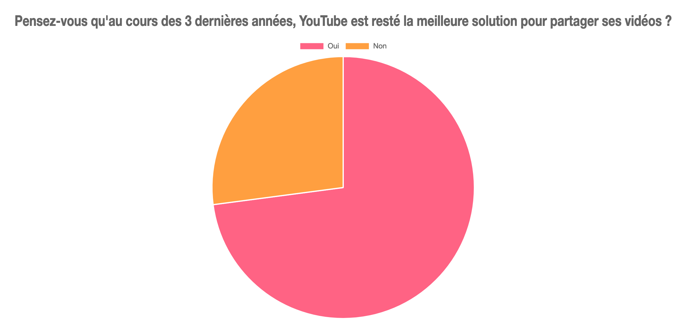
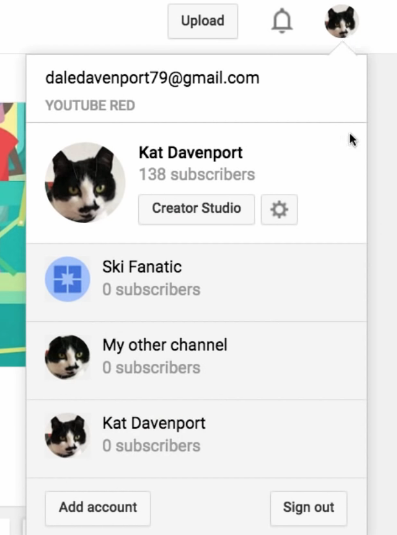
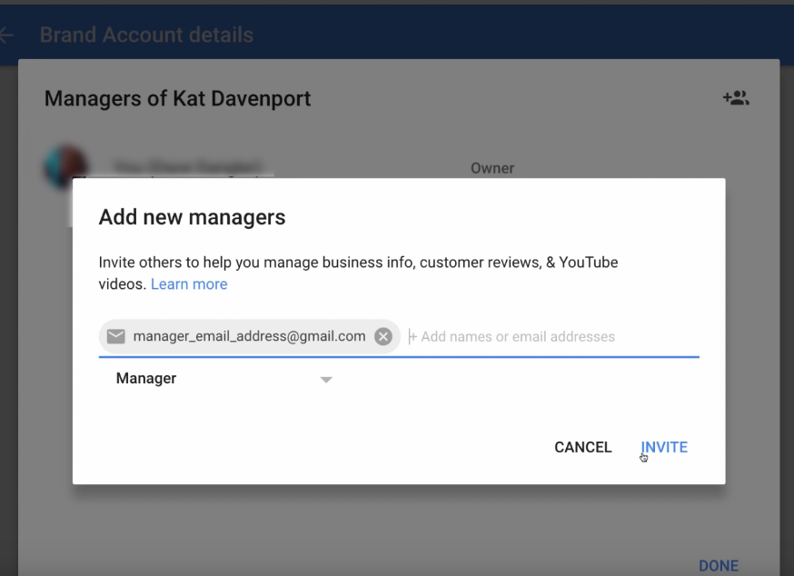
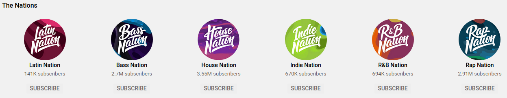
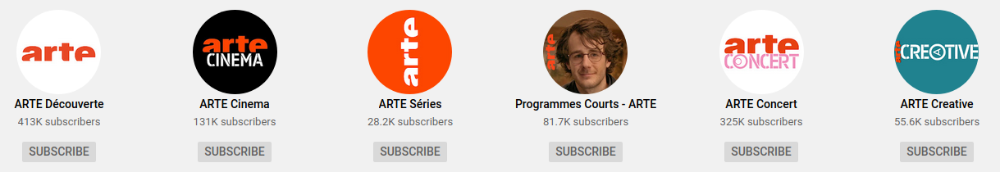
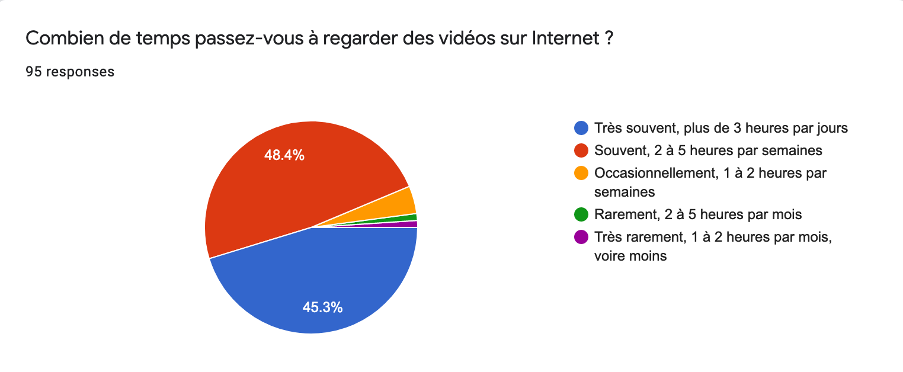
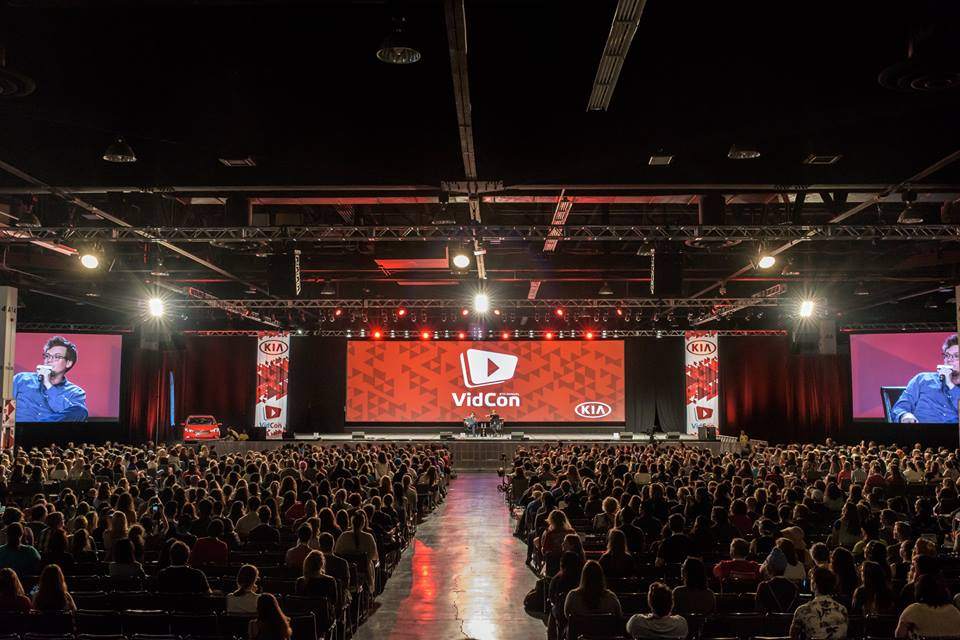
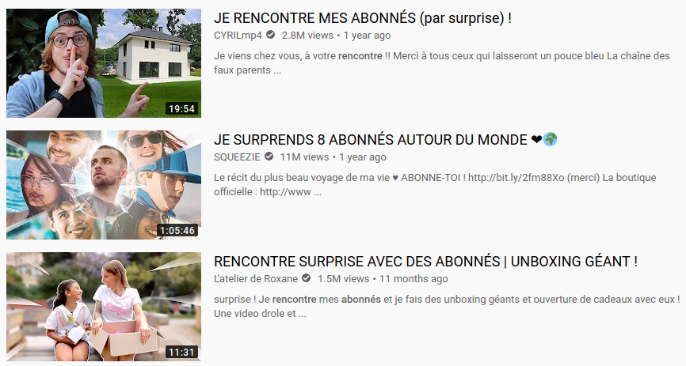
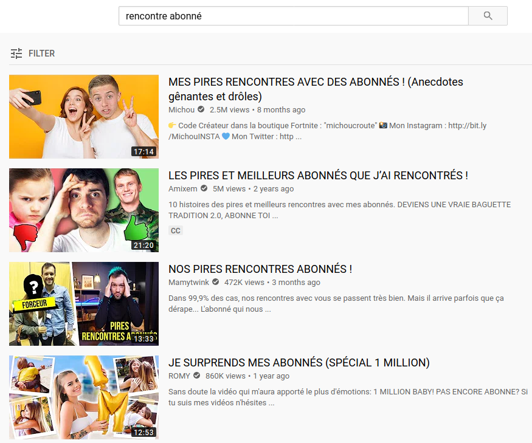
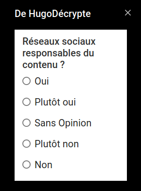

La vidéo est devenue omniprésente dans notre utilisation quotidienne d'Internet. Nous savons qu'une vidéo permet de partager des idées, des opinions ou simplement de divertir en y mettant la forme que l'on souhaite. Souvent inspirés des formats télévisés, la création de vidéo est aujourd'hui une activité qui s'est énormément démocratisée, notamment grâce à Internet. YouTube, l'un des premiers acteurs à avoir ouvert la voie, est aujourd'hui un leader dans ce domaine. Autant destiné aux particuliers qu'aux professionnels, YouTube propose de nombreuses fonctionnalités qui semblent le rendre indétrônable.

#### Avantages

Parmis les avantages concurrentiels de la plateforme de Google, nous avons identifié les suivants :

-   **Popularité**: Le trafic quotidien rend les plateformes très intéressantes pour la visiblité des créateurs.
-   **Stabilité et performances**: La stabilité technique de ces services permet de garantir un confort non négligeable pour les utilisateurs, y compris pour les sociétés réclamant un service de qualité gratuitement.
-   **Proximité avec la communauté**: Ces services offrent généralement une bonne proximité avec les personnes qui nous suivent.
-   **Modèle économique simple**: Le modèle de la publicité en ligne est très simple puisqu'il ne nécessite aucune action particulière de la part de l'utilisateur.
-   **Fonctionnalités nombreuses**: Les fonctionnalités proposées sont très avantageuses et permettent aux créateurs de visualiser leurs données, leurs revenus et de créer davantage. Les vidéos peuvent également être intégrées très facilement sur un site externe.
-   **Opportunités professionnelles**: Ces dernières années, les opportunités de se professionnaliser en tant que créateur de vidéo se sont multipliées. YouTube propose notamment de nombreux avantages pour fidéliser les utilisateurs réalisant le plus d'audience. Notamment avec le [YouTube Space](https://www.youtube.com/space/), un studio de tournage mis à disposition des créateurs dans de nombreux pays dont la France. Les studios de tournage proposent également des formations sur diverses thématiques autour de la création de vidéo.
-   **Ressources nombreuses**: YouTube met de nombreuses ressources en ligne à disposition des créateurs pour les aider à tirer le meilleur de leur contenu.

#### Désavantages

-   **L'apprentissage machine rend la modération inefficace**: Les grandes sociétés se tournent de plus en plus vers l'apprentissage machine (dite Intélligence Artificielle, ou IA) pour modérer le contenu automatiquement. Le résultat s'est montré peu glorieux: des vidéos bloquées par erreur, du contenu offensant non détecté, des mots censurés sans raison etc. Par ailleurs, ces algorithmes ne sont pas transparents, et ne permettent pas à l'utilisateur de voir comment ses préférences sont ajustées.
-   **Modèle économique instable**: Puisque se sont les annonceurs qui alimentent le modèle économique, leurs décisions ont de grands impacts sur la capacité de la rémunération. Lorsqu'un type de vidéo ne plait pas aux annonceurs, ils peuvent décider de ne pas afficher leur publicité sur ces dernières, les rendant non monétisables par la plateforme.
-   **L'algorithme de recommandation peine à trouver du contenu de qualité**: YouTube pousse de moins en moins à la découverte de créateurs, produisant un vrai travail. La plateforme ne s'adapte pas aux centres d'intérêts de l'utilisateurs mais aux centres d'intérêts de tous en même temps.
-   **Manque de personnalisation**: L'utilisateur ne contrôle pas comment les vidéos lui sont recommandées, ni le contenu qu'il souhaite retrouver sur sa page d'accueil. La majorité des recommandations sont basées sur l'audience et l'engagement. Poussant notamment les créateurs à réaliser fréquemment du contenu qui pousse au clique.
-   **Gouvernance centralisée, manque de transparence et d'éthique**: Il n'y a aucun moyen de savoir comment fonctionnent la plateforme, leur façon de modérer le contenu, de traiter les données personnelles, ou encore d'analyser les vidéos. L'entreprise YouTube décide du sort des créateurs, de l'avenir de leur chaîne, de leur salaire et de comment leurs vidéos sont référencées. Lorsqu'un créateur n'est pas viable commercialement, la plateforme peut lui retirer le droit de monétiser son contenu et ce dernier peut se retrouver privé de son audience, dans le cas où sa chaîne se fait supprimer.

### Gérer une chaîne à plusieurs

Il est devenu très courant pour des vidéastes de se lancer dans un projet de chaîne à plusieurs, a tel point que YouTube a dû y consacrer une fonctionnalité pour faciliter ce procédé. En effet, il est possible d'ajouter des utilisateurs en tant que _manager_ sur une chaîne YouTube. Ces managers pourront ensuite gérer la chaîne ainsi qu'accèder aux différentes données et paramètres de celle-ci.

Au fil des années, le contenu des chaînes s'est structuré de plus en plus et les créateurs désireux de partager du contenu différent ou de s'adonner à d'autres types de vidéo ont parfois dû créer des chaîne secondaires. Il est donc possible pour un même utilisateur de créer plusieurs chaînes différentes.

Ces fonctionnalités pourtant simples, permettent aux créateurs d'avoir une activité variée sur la plateforme, et de ne pas limiter leur contenu qu'à une seule chaîne. Les chaînes ne représentent donc, de manière générale, non plus des chaînes personnelles mais un programme avec un format bien particulier et une audience qui lui est propre.

### Proximité et intéractions avec son audience

Notre étude à permis de constater que la consommation de vidéo en ligne prend énormément de place dans la vie des jeunes de 18 à 35 ans. Ceci peut notamment s'expliquer par la très grande variété de contenu présente sur la plateforme de Google et Internet de façon générale.

Grâce aux réseaux sociaux, les abonnés peuvent être davantage en contact avec leurs créateurs favoris. Les différents événements organisés permettant aux fans de les rencontrer dans le monde réel et aux créateurs de se rencontrer entre eux se sont multipliés ces dernières années. Bien que certains de ces événements n'aient pas été créés dans le but de réunir des vidéastes et leurs fans (_Japan Expo, Paris Games Week, Toulouse Game Show..._), la communauté du partage de contenu sur Internet s'est approprié ces événements et les utilise, non seulement comme un moyen de découvrir différentes cultures (animation, jeux vidéo, animes, dessin...), mais aussi comme lieu de rencontre pour créer et échanger.

Aux États-Unis à lieu notamment chaque année la [VidCon](https://www.vidcon.com/), un événement à destination des créateurs et comédiens durant lequel les vidéastes peuvent échanger, créer, rencontrer leurs fans, ou encore animer des stands ou conférences.

_Crédit photo: [Kongres Magazine](https://kongres-magazine.eu/2018/02/vidcon-worlds-largest-online-video-conference-set-return-melbourne/)_

Cette proximité est très souvent cultivée par les créateurs afin de garder le contact avec leurs fans mais aussi pour permettre de diversifier leur activité en dehors du virtuel, certains vidéastes évoluants par exemple dans [le théatre, le cinéma ou encore le stand up](https://www.youtube.com/watch?v=TyY_AZMVkrE). Rencontrer ses spectateurs peut aussi être source de contenu et permet de découvrir l'audience qui se cache derrière certaines chaînes.

Le duo **Mcfly et Carlito** qui rend visite à quelques uns de leurs abonnés pour leur offrir des objets :

<iframe width="560" height="315" src="https://www.youtube-nocookie.com/embed/M1PiAic9vFM" frameborder="0" allow="accelerometer; autoplay; encrypted-media; gyroscope; picture-in-picture" allowfullscreen></iframe>

Mais en dehors des réseaux sociaux, les créateurs ont de nombreux moyens à disposition pour intéragir avec leur audience. Par exemple, de plus en plus de créateurs de vidéos se lancent dans la diffusion en direct. Cela permet d'avoir les réactions des spectateurs en temps réel et de discuter sans pour autant être en contact avec eux physiquement. Sur YouTube, cela fait des années que cette fonctionnalité est disponible. Concernant les vidéos, les commentaires et les sondages sont aussi deux moyens efficaces de donner la parole à son audience.

* * *

Depuis quelques années, un format de vidéo initialement utilisé dans les jeux vidéos a refait surface sur le web : les vidéos intéractives. Un format également expérimenté par des grands producteurs comme [Netflix](https://www.netflix.com/fr/) avec leur film intéractif [Black Mirror: Bandersnatch](https://en.wikipedia.org/wiki/Black_Mirror%3A_Bandersnatch). Les vidéos intéractives ont également pris place sur YouTube. En voici un exemple avec le court métrage intéractif du vidéaste et comédien Ludovik :

<iframe width="560" height="315" src="https://www.youtube-nocookie.com/embed/v3ewiTIcLiQ" frameborder="0" allow="accelerometer; autoplay; encrypted-media; gyroscope; picture-in-picture" allowfullscreen></iframe>

Ce type de vidéo constitue une façon supplémentaire de créer de l'intéraction avec son audience, à travers du contenu en ligne, et notamment des vidéos qui jusqu'ici demandaient à l'utilisateur de rester passif.

## Modération

### Ce qu'en disent les créateurs

Le 12 Avril 2020, Le Radis Irradié, un vidéaste français explique s'être fait censuré par YouTube pour une vidéo postée 2 jours plus tôt. Selon YouTube, sa vidéo dénoncant une arnaque sur Internet, ne respectait pas les règles de la communauté.

[Tweet de "Le Radis Irradié", vidéaste français][9] \[[archive][9_archive]]

Peu après ce tweet, une vidéo est publiée sur YouTube par Le Radis Irradié pour expliquer les faits à sa communauté. Il explique notamment qu'après de nombreux partages, son cas a finalement pu être remonté aux équipes de modération de la plateforme et qu'il s'agit bien d'une erreur. Une erreur qui aurait cependant pu lui coûter le droit de monétiser d'autres vidéos, voire même d'en publier.

<iframe width="560" height="315" src="https://www.youtube-nocookie.com/embed/34-KiobBdDM" frameborder="0" allow="accelerometer; autoplay; encrypted-media; gyroscope; picture-in-picture" allowfullscreen></iframe>

Nombreux sont les créateurs qui sont satisfaits de YouTube et n'ont aucun problème avec la plateforme qui leur apporte confort et stabilité. La plateforme fait de nombreux efforts pour apporter de la nouveauté à travers de nouvelles fonctionnalités et une plus grande transparence. Cependant depuis quelques années, les avis mécontents se sont multipliés et les problèmes de censure, monétisation, ou encore de modération sont chaque années plus nombreux.

Face à l'augmentation de la censure et de la pression mise par la plateforme concernant la monétisation, les vidéastes se sont vus contraints de revoir leur format de vidéo, parfois même leur concept, jusqu'à créer des vidéos moins intéressantes mais qui génèrent plus de vues.

<a href="https://www.reddit.com/r/youtube/comments/79p77w/can_we_discuss_how_awful_the_yt_trending_page_has/">Discussion Reddit</a> dans <strong>/r/youtube</strong>

> Peut-on discuter de l'horreur que représente la page des tendances YouTube ?

> Il n'y a que des clips de télévision et de sociétés tierces qui veulent faire connaître leur marque (sports, talk-shows, etc.) mélangés avec des YouTubers tout public qui ne sont même pas en tendance mais qui sont juste choisis à la main par quelqu'un de chez YouTube...

### Ce qu'en dit la presse

_"Quand la censure de Youtube va trop loin"_, [cet article de  Marion Jaumotte sur RTBF][10] en Juin 2019, raconte comment des historiens on vu leurs vidéos supprimées à cause d'un mauvais ajustement dans l'algorithme de modération.

> La modération faite par des algorithmes a démontré ses limites en censurant tout un tas de vidéos de youtubeurs et d’historiens.

> Depuis que Youtube a durci sa politique relative aux contenus faisant l’apologie des propos haineux, de la discrimination ou de la ségrégation, certains youtubeurs et professeurs d’histoire tirent la sonnette d’alarme car leur contenu à caractère éducatif a également été supprimé…

* * *

Les problèmatiques qui émanent de la plateforme de Google sont nombreuses et beaucoup relayés via la presse et les réseaux sociaux. Cependant, il ne doit être négligé que YouTube apporte des ressources et une expérience utilisateur suffisamment bonne pour que ces vidéastes continuent d'utiliser la plateforme de Google, malgré les difficultés qu'ils rencontrent. La difficulté à trouver une alternative fiable y est aussi pour quelque chose.

### Les commentaires

Parmis les ressources mises à disposition, nous retrouvons le YouTube Studio. Il s'agit d'une fonctionnalité récente de la plateforme qui permet aux créateurs de gérer leur chaîne, visualiser les statistiques, ainsi que suivre l'évolution de leur nombre d'abonnés. Cette fonctionnalité permet notamment de modérer les commentaires que le créateur reçoit, de les filtrer par ancienneté ou par type. Il est aussi possible de déléguer la modération des commentaires à d'autres utilisateurs pour qu'ils puissent s'en occuper à votre place. La section commentaire peut être désactivée sur des vidéos précises, choisies au préalable par le créateur.

## Ressources

-   [L’ADN : “YouTube burn-out : les vidéastes cherchent des portes de sortie”][1] \[[archive][1_archive]]
-   [Les echos “La grogne des youtubeurs face aux nouvelles règles de monétisation”][2] \[[archive][2_archive]]
-   [Numerama : dans la peau des petits vidéastes qui n’ont jamais percé sur YouTube][3] \[[archive][3_archive]]
-   [L’ADN : Comment les youtubeurs se font financer par leur communauté][4] \[[archive][4_archive]]
-   [Interview du youtubeur Amixem : sur YouTube il faut plaire à l'algorithme][5] \[[archive][5_archive]]
-   [Joueur du Grenier : “Youtube m'ennuie.”][6]
-   [Quand la censure de Youtube va trop loin][10] \[[archive][10_archive]]
-   [Vidéos complotistes : « YouTube a la capacité de modérer son contenu lorsqu’il en a la volonté politique »][11] \[[archive][11_archive]]

[1]: https://www.ladn.eu/media-mutants/tv-et-nouvelles-images/comment-youtubeurs-font-financer-communaute/

[1_archive]: https://www.ladn.eu/media-mutants/tv-et-nouvelles-images/comment-youtubeurs-font-financer-communaute/

[2]: https://start.lesechos.fr/innovations-startups/tech-futur/la-grogne-des-youtubeurs-face-aux-nouvelles-regles-de-monetisation-11623.php

[2_archive]: https://start.lesechos.fr/innovations-startups/tech-futur/la-grogne-des-youtubeurs-face-aux-nouvelles-regles-de-monetisation-11623.php

[3]: https://www.numerama.com/pop-culture/510021-remuneration-difficile-manque-de-reconnaissance-les-petits-videastes-ont-le-blues-sur-youtube.html

[3_archive]: https://www.numerama.com/pop-culture/510021-remuneration-difficile-manque-de-reconnaissance-les-petits-videastes-ont-le-blues-sur-youtube.html

[4]: https://www.ladn.eu/media-mutants/tv-et-nouvelles-images/comment-youtubeurs-font-financer-communaute/

[4_archive]: https://www.ladn.eu/media-mutants/tv-et-nouvelles-images/comment-youtubeurs-font-financer-communaute/

[5]: https://www.ladn.eu/media-mutants/tv-et-nouvelles-images/amixem-youtube-surtout-plaire-algorithme/

[5_archive]: https://www.ladn.eu/media-mutants/tv-et-nouvelles-images/amixem-youtube-surtout-plaire-algorithme/

[6]: https://www.youtube.com/watch?v=dZOpobOhOEc

[9]: https://twitter.com/LeRadisIrradie/status/1249248845172805632

[9_archive]: https://web.archive.org/web/20200412085741/https:/twitter.com/LeRadisIrradie/status/1249248845172805632

[10]: https://www.rtbf.be/culture/article/detail_quand-la-censure-de-youtube-va-trop-loin-marion-jaumotte?id=10257454

[10_archive]: https://www.rtbf.be/culture/article/detail_quand-la-censure-de-youtube-va-trop-loin-marion-jaumotte?id=10257454

[11]: https://www.lemonde.fr/pixels/article/2020/03/06/videos-complotistes-youtube-a-la-capacite-de-moderer-son-contenu-lorsqu-il-en-a-la-volonte-politique_6032050_4408996.html

[11_archive]: https://www.lemonde.fr/pixels/article/2020/03/06/videos-complotistes-youtube-a-la-capacite-de-moderer-son-contenu-lorsqu-il-en-a-la-volonte-politique_6032050_4408996.html
