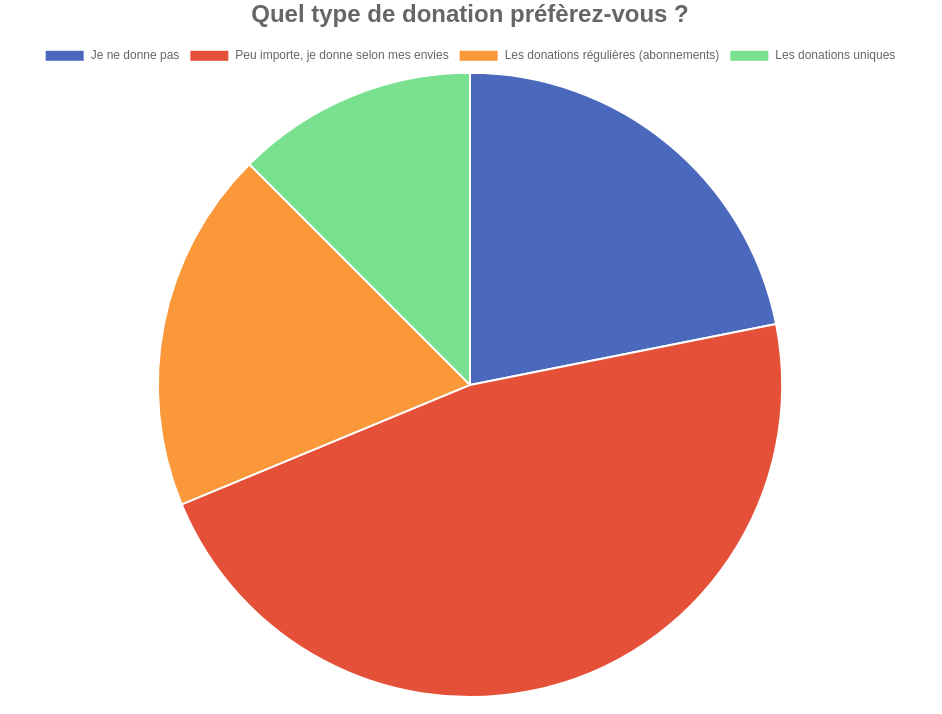

Les questions environnementales sont depuis plusieurs années déjà, au coeur des débats concernant Google. Leur plateforme de partage de vidéos atteignant le milliard d'utilisateur et le nombre de vidéos ajoutées chaque minute grandissant sans cesse, il est évident que l'impact écologique de la firme n'est pas sans conséquence. Ces questions environnementales inquiètent les ONG.

Selon [cet article de l'OBS][3] en 2015 :

> Si vous ajoutez l'électricité consommée par les centres de données et les réseaux nécessaires pour connecter tous nos appareils, cela représenterait le sixième pays qui consomme le plus au monde", pointe Gary Cook de Greenpeace, dans le "Time". "Ce n'est pas le pire, mais c'est significatif et ça va aller en augmentant..."

* * *

> Seulement, 3,3 milliards de recherches [sont effectuées chaque jour](http://www.businessinsider.com/500m-things-google-has-never-heard-of-2013-5?IR=T) sur le moteur de Google, soit 660 tonnes de CO2 émis chaque jour, ou 241.000 tonnes par an.

* * *

> Regarder 10 minutes de vidéo de chats représente 1g de CO2. Google tente de temporiser en expliquant que "l'utilisation continue de YouTube pendant trois semaines demande à peu près autant d'énergie qu'il n'en faut pour faire une lessive en machine". Seulement, chaque jour, des "centaines de millions d'heures de vidéos" sont regardées sur YouTube, soit plus de 600 tonnes de CO2 émis chaque jour, ou plus de 219 millions de tonnes de CO2 chaque année.

Face à ses enjeux de taille, Google a depuis mis en place de nombreuses mesures pour réduire son impact environnemental. C'est même devenu un argument marketing puisque Google Cloud Platform, le service cloud de Google affiche désormais sur son site web n'utiliser que de l'énergie 100% renouvelable.

### Ressources

-   [Réduire son empreinte écologique sur Youtube][1] \[[archive][1_archive]]
-   [Etude : comment faire pour rendre YouTube moins polluant ?][2] \[[archive][2_archive]]
-   [Les vidéos de chat polluent plus que les avions][3] \[[archive][3_archive]]
-   [Interview de Cécile Frot-Coutaz: les dessous de YouTube][4]
-   [Rapport environnemental de Google en 2018][5] \[[archive][5_archive]]

[1]: https://www.francemusique.fr/emissions/musique-connectee/reduire-son-empreinte-ecologique-sur-youtube-72015

[1_archive]: https://web.archive.org/web/20190516112326/https://www.francemusique.fr/emissions/musique-connectee/reduire-son-empreinte-ecologique-sur-youtube-72015

[2]: https://www.ladn.eu/adn-business/news-business/actualites-media/etude-reduire-empreinte-carbone-youtube/

[2_archive]: https://web.archive.org/web/20200418140547/https://www.ladn.eu/adn-business/news-business/actualites-media/etude-reduire-empreinte-carbone-youtube/

[3]: https://www.nouvelobs.com/les-internets/20150930.OBS6808/les-videos-de-chat-polluent-plus-que-les-avions.html

[3_archive]: https://web.archive.org/web/20190902231138/https://www.nouvelobs.com/les-internets/20150930.OBS6808/les-videos-de-chat-polluent-plus-que-les-avions.html

[4]: https://www.youtube.com/watch?v=M3QwH6h9lTc

[5]: https://storage.googleapis.com/gweb-sustainability.appspot.com/pdf/Google_2018-Environmental-Report.pdf

[5_archive]: https://storage.googleapis.com/gweb-sustainability.appspot.com/pdf/Google_2018-Environmental-Report.pdf
