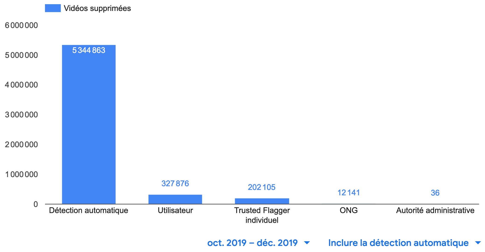
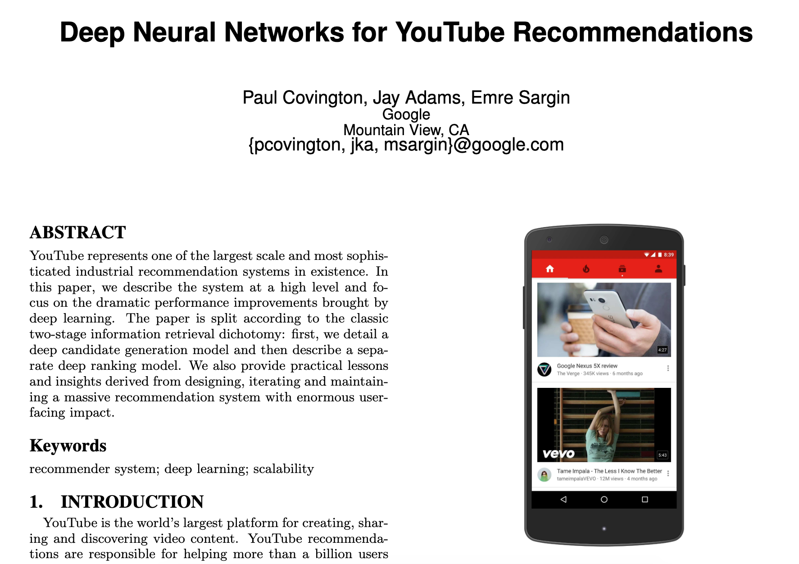
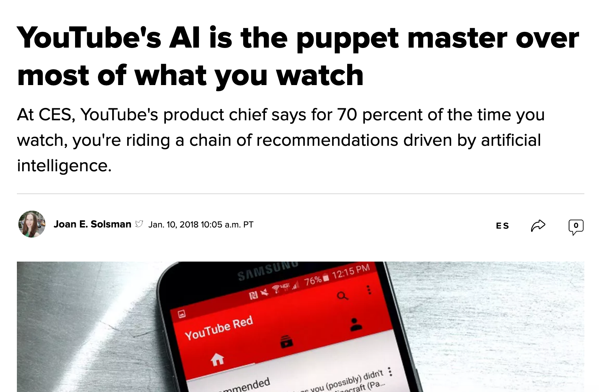

Tout comme l'écologie, les questions de transparence et de respect de la vie privée concernant Google ont pendant des années fait l'objet de débats controversés. C'est un sujet sur lequel Google a dû faire des efforts afin de rassurer la communauté.

## Application du réglement

> Chez YouTube, nous nous efforçons de préserver une communauté sûre et dynamique. Le règlement de la communauté définit les règles de conduite à suivre sur YouTube. Par exemple, nous n'autorisons pas la pornographie, l'incitation à la violence ou à la haine, ni le harcèlement.

Peut-on lire sur le rapport d'[application du règlement de la communauté YouTube][3]. En effet depuis 2017, YouTube partage ces statistiques relatives à la suppression de vidéos, chaînes, ou encore commentaires.

> Nous nous appuyons à la fois sur les individus et sur la technologie pour signaler le contenu inapproprié et faire respecter ces règles. Les signalements peuvent provenir de nos systèmes de détection automatique, de membres du programme Trusted Flagger (ONG, autorités administratives et individus) ou d'utilisateurs au sein de la vaste communauté YouTube.

Ce graphique indique le nombre de vidéos supprimées par YouTube en fonction de la source de détection initiale (signalement automatique ou détection manuelle). Les signalements par détection manuelle peuvent provenir d'un utilisateur ou d'un membre du programme [Trusted Flagger](https://support.google.com/youtube/answer/7554338) de YouTube. Un programme composé d'individus, d'ONG et d'autorités administratives qui informent YouTube des cas de contenus enfreignant le règlement de la communauté.

> YouTube est une communauté et, au fil des ans, les internautes ont utilisé la fonctionnalité de signalement située sous chaque vidéo et chaque commentaire pour signaler le contenu qui, selon eux, enfreint le règlement de la communauté. Nous souhaitons permettre à la communauté YouTube de comprendre comment fonctionne le signalement et de contribuer au respect du règlement de la communauté.

Cependant ce que YouTube ne dévoile pas, c'est le fonctionnement de la détection automatique, vraisemblablement responsable de la majorité de la suppression de contenu. **Parmis plus de 5,8 milliards de vidéos supprimées entre Octobre et Décembre 2019, 5,3 milliards l'ont été par la détection automatique**, soit environ 90%.

## L'algorithme de recommandation, un fonctionnement obscur ?

Dans un document de recherche publié en 2016, un groupe d'ingénieurs de Google a fait part de ses projets sur la manière dont les vidéos pourraient être référencées par le moteur de recommandation de YouTube pour une meilleure expérience utilisateur.

Bien qu'il n'ait pas attiré beaucoup d'attention à l'époque, il est très pertinent pour YouTube aujourd'hui puisque, selon le chef de produit de YouTube, 70 % des vues de YouTube passent maintenant par ce moteur de recommandation.

> Le chef de produit de YouTube affirme que dans 70 % des cas, vous suivez une chaîne de recommandations orchestrée par un algorithme d'apprentissage automatique.

### Le P-Score YouTube

...

## Ressources

-   [Creators Say They’ve Cracked YouTube’s Monetization Algorithm][1] \[[archive][1_archive]]
-   [The YouTube P-Score — Is it the End of Real Viral Videos?][2] \[[archive][2_archive]]
-   [Rapport de transparence Google][3] \[[archive][3_archive]]
-   [How the YouTube Algorithm Works (Or Why Your Videos Aren’t Getting Views)][4] \[[archive][4_archive]]
-   [Document de recherche sur l'algorithme de recommandation YouTube][5] \[[archive][5_archive]]
-   [YouTube's AI is the puppet master over most of what you watch][6] \[[archive][6_archive]]

[1]: https://ffwd.medium.com/creators-think-theyve-reverse-engineered-the-p-score-youtube-s-monetization-algorithm-ce64c95a4510

[1_archive]: https://ffwd.medium.com/creators-think-theyve-reverse-engineered-the-p-score-youtube-s-monetization-algorithm-ce64c95a4510

[2]: https://medium.com/swlh/the-youtube-p-score-is-it-the-end-of-real-viral-videos-45f0f73ec247

[2_archive]: https://medium.com/swlh/the-youtube-p-score-is-it-the-end-of-real-viral-videos-45f0f73ec247

[3]: https://transparencyreport.google.com/youtube-policy/removals

[3_archive]: https://transparencyreport.google.com/youtube-policy/removals

[4]: https://www.shopify.com/blog/youtube-algorithm

[4_archive]: https://www.shopify.com/blog/youtube-algorithm

[5]: https://static.googleusercontent.com/media/research.google.com/en//pubs/archive/45530.pdf

[5_archive]: https://static.googleusercontent.com/media/research.google.com/en//pubs/archive/45530.pdf

[6]: https://www.cnet.com/news/youtube-ces-2018-neal-mohan/

[6_archive]: https://www.cnet.com/news/youtube-ces-2018-neal-mohan/
