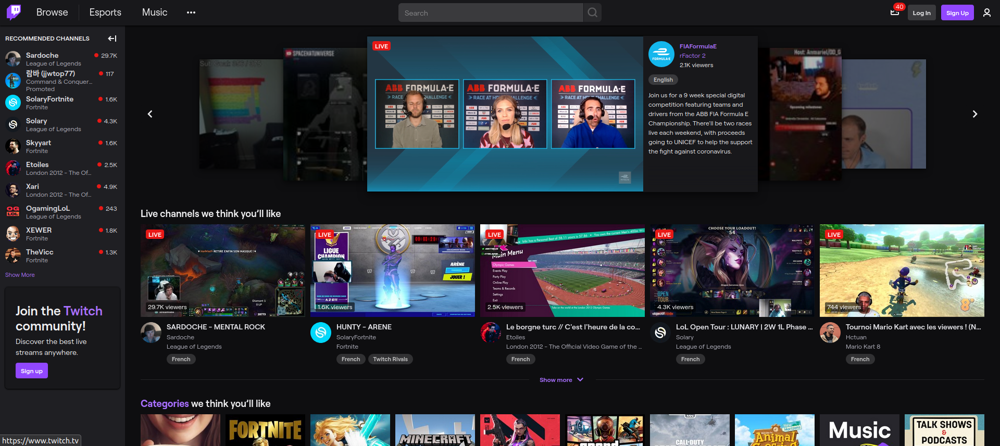
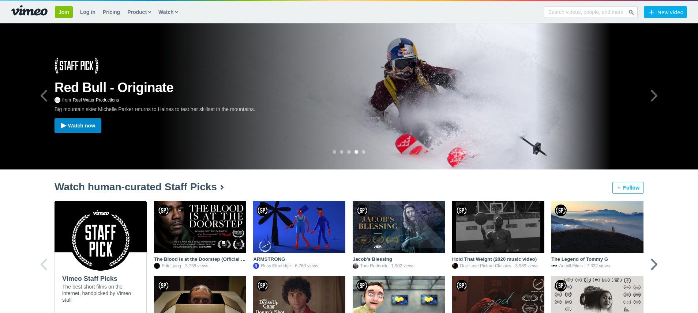
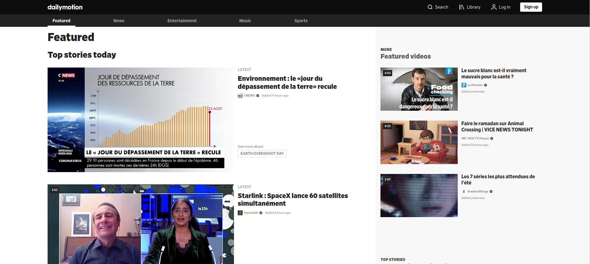
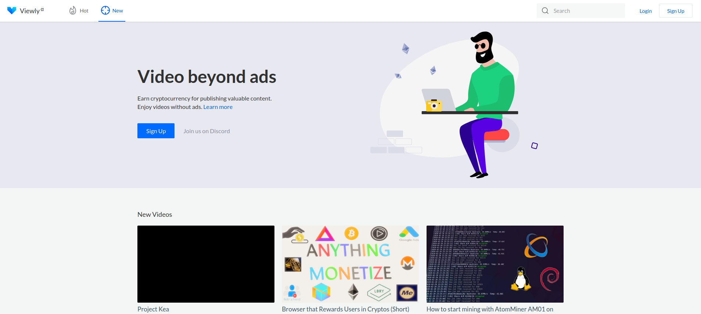
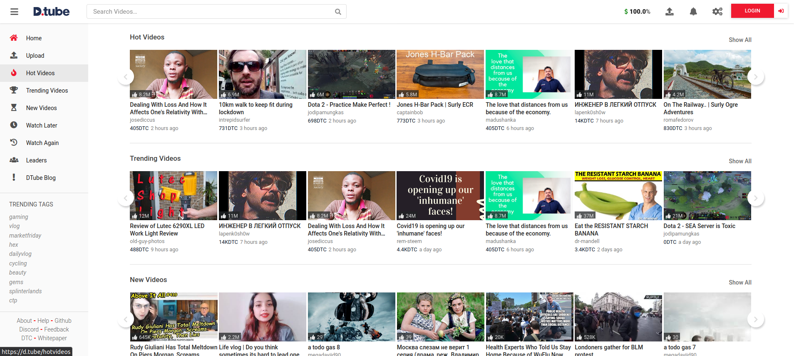
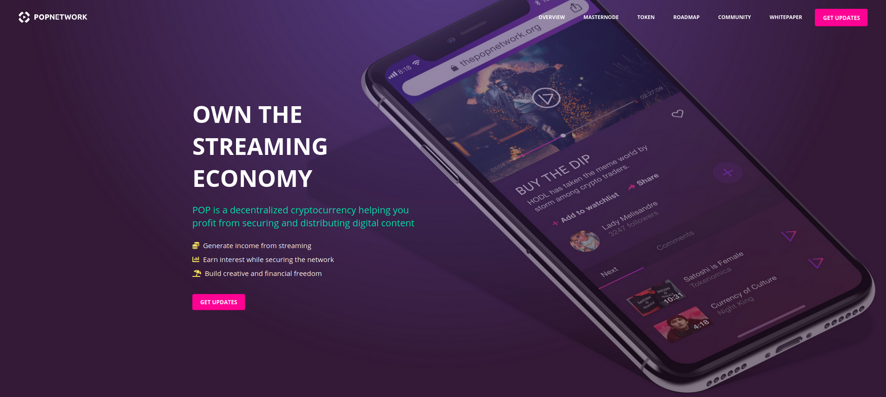
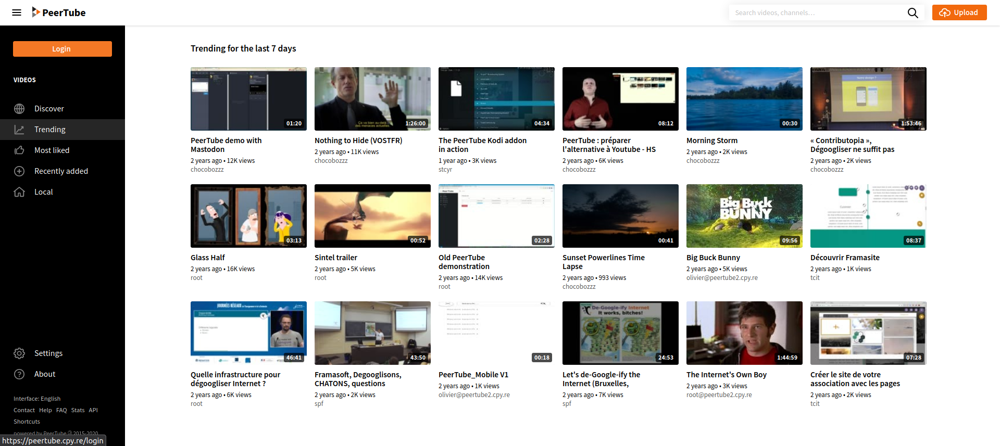
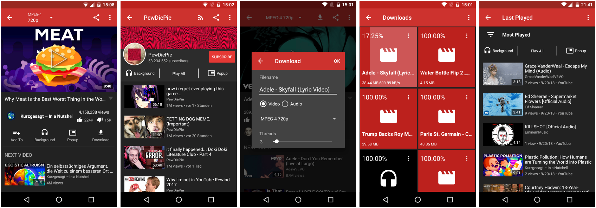

Lancer une plateforme de partage de vidéo n'est pas une chose facile. D'abord parce qu'il est souvent difficile de faire du profit avec le coût que représente l'entretient d'un tel projet, mais aussi car créer une plateforme de partage de vidéo c'est se placer comme un concurrent direct de YouTube. Les alternatives décentralisées actuelles fonctionnent pour la plupart que sur des systèmes ou des technologies encore expérimentales. Cela contribue à les rendre souvent instable ou moins performantes. Parmis les nombreuses alternatives à la plateforme de Google, nous retrouvons des fonctionnements innovants reposants sur des modèle économiques parfois très particuliers comme la cryptomonnaie. Si les plateformes alternatives se créent pour résoudre des problèmes similaires mais de différentes façons, leurs objectifs ne sont pas toujours communs.

### Plateformes

Nous avons identifié différents acteurs principaux sur le marché du partage de vidéos, en voici une liste non-exhaustive :

| Plateforme                          | Décentralisée | Open source | Source(s) de revenu             | Version |
| ----------------------------------- | ------------- | ----------- | ------------------------------- | ------- |
| [YouTube](https://www.youtube.com/) | Non           | Non         | Publicité/abonnements           | Stable  |
| [Twitch](#twitch)                   | Non           | Non         | Publicité/abonnements/donations | Stable  |
| [Vimeo](#vimeo)                     | Non           | Non         | Publicité/abonnements           | Stable  |
| [Dailymotion](#dailymotion)         | Non           | Non         | Publicité                       | Stable  |
| [View.ly](#viewly)                  | Oui           | Oui         | Cryptomonnaie/donations         | Alpha   |
| [D.Tube](#dtube)                    | Oui           | Oui         | Cryptomonnaie/donations         | Bêta    |
| [PopChest](#popchest)               | Oui           | Oui         | Cryptomonnaie/donations         | Bêta    |
| [PeerTube](#peertube)               | Oui           | Oui         | Aucune                          | Stable  |
| [NewPipe](#newpipe)                 | Oui           | Oui         | Aucune                          | Bêta    |

* * *

#### Twitch

...

#### Vimeo

...

#### Dailymotion

...

#### View.ly

View.ly est une plateforme de partage de vidéo décentralisée et open source qui fonctionne sur la blockchain. Le projet se focalise sur 3 problèmes clés des plateformes propriétaires : la démonétisation, la publicité et le coût de la charge de serveur. Pour répondre à ses problèmatiques, Viewly propose les solutions suivantes : un support financier directement par la communauté, une plateforme sans publicité et de la diffusion utilisant le réseau pair-à-pair (P2P). La blockchain joue aussi un rôle majeur car elle permet de contrôler la monétisation sans passer par la plateforme comme intermédiaire. Les donations arrivent directement dans la poche du créateur. La plateforme fonctionne sur avec un système de relais. Cela veut dire qu'une plateforme constitue un relai et que pour chaque relai, c'est une source supplémentaire pour la diffusion de vidéos.

#### D.Tube

D.Tube est une plateforme de partage de vidéo décentralisée qui utilise la blockchain et la cryptomonnaie pour rémunérer ses utilisateurs. Le concept de D.Tube c'est une plateforme libre où chacun peut partager et regarder du contenu sans publicité, sans algorithme de recommandation et le tout en gagnant de l'argent. Sur D.Tube, les vues se comptent en cryptomonnaie. DTube est une plateforme auto-gouvernée, ou un nombre limité de leaders sont élus et sont en charge de produire les nouveaux blocks et de sécuriser l'infrastructure. Les utilisateurs ont la possibilité de voter pour un maximum de 5 leaders.

#### PopChest

...

#### PeerTube

PeerTube est un projet français de plateforme de partage de vidéo libre, open-source et décentralisée créée par [Chocobozzz](<>) et financé principalement par [Framasoft](<>). Le principe est simple : créer un écosystème décentralisé constitué de plusieurs plateformes qui peuvent s’allier. PeerTube n’est pas une seule plateforme d’hébergement vidéo avec un unique groupe de règles : c’est un réseau de dizaines d’hébergeurs interconnectés, et chaque hébergeur est composé de personnes et d’administrateurs différents. Vous n’aimez pas certaines règles ? Vous êtes libre de rejoindre l’hébergeur de votre choix, ou mieux encore, être votre propre hébergeur avec vos propres règles ! En s’alliant avec d’autres instances de PeerTube, les vidéos sont partagées sur les instances alliées et à terme, la redondance pourra même être partagée.

Suite à un financement participatif lancé entre mars et juillet 2018, Framasoft a pu financer l'emploi du développeur principal de PeerTube. Ainsi, après une version bêta en mars 2018, la version 1 est sortie en novembre 2018. Depuis, plusieurs versions intermédiaires ont apporté de nombreuses fonctionnalités. Plusieurs collectifs ont déjà monté des hébergements PeerTube, créant ainsi les bases de la fédération.

#### NewPipe

...

[][1]

* * *

### Ressources

-   [NewPipe, un client YouTube open source et intuitif pour Android][1]

[1]: https://newpipe.schabi.org/
