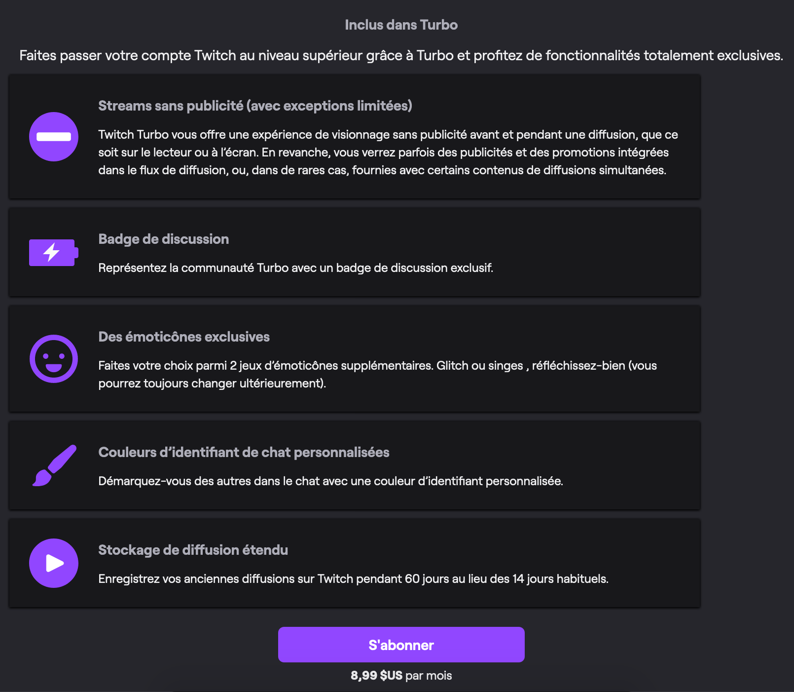

# Modèle économique

Bien que la publicité ait toujours été le moyen le plus efficace et rapide de monétiser du contenu sur Internet, de nombreux modèles économiques ont émergés et il est aujourd'hui possible de vivre de son activité sur Internet de différentes façons. Parmis les alternatives à YouTube que nous avons présenté, nombreuses sont celles qui reposent sur des modèles économiques reposants sur des technologies encore expérimentales, comme la cryptomonnaie. Selon le modèle économique adopté, l'utilisateur peut jouer un rôle passif ou déterministe. En effet sur YouTube, l'utilisateur ne voit que de la publicité et n'a pas d'argent à dépenser pour faire gagner de l'argent au créateur, il joue donc un rôle passif. Bien que depuis quelques années YouTube tend à devenir moins dépendant de la publicité. Mais alors est-ce que YouTube a habitué les internautes à ne pas dépenser d'argent pour soutenir des créateurs ?

### Le modèle "payer pour créer, créer pour vendre"

Depuis 2017, Vimeo propose des offres payantes à ses utilisateurs, notamment pour pouvoir ajouter davantage de vidéo. L'offre payante se compose de 4 propositions allant de 6 à 70€ par mois : **Plus**, **Pro**, **Business**, **Premium**.

Les principaux avantages des offres payantes sont les suivants :

-   Plus d'espace de stockage pour ajouter des vidéos
-   Possibilité de créer une équipe pour collaborer
-   Diffusion en direct
-   Personnalisation du player vidéo
-   Support des formats vidéo 4K et HDR
-   Suppression de la publicité
-   Fonctionnalité de création de vidéo en ligne
-   Statistiques avancées
-   Support client prioritaire
-   Fonctionnalité de vente de vidéos
-   Fonctionnalités marketing
-   Meilleur contrôle du respect de la vie privée

Le modèle économique de Vimeo s'adresse donc principalement à des professionnels, des entreprises, voulant partager des vidéos de qualité professionnelle et même de les commercialiser. Cela a permis à Vimeo de se démarquer sur le marché alors que la plupart des sites de partage de vidéos utilisaient un modèle de revenus basé sur la publicité. Vimeo l'utilise également comme [promesse marketing](https://fr.wikipedia.org/wiki/Promesse_(marketing)) pour attirer des spectateurs d'autres sites. Il est passé de la concurrence avec YouTube à une plate-forme permettant aux professionnels et aux entreprises de partager et de présenter leur contenu.

### Le modèle de l'abonnement

Le modèle économique de Twitch se base sur les abonnements de chaîne, les chaînes répondant à certains critères sont éligibles à un partenariat avec Twitch ce qui leur permet d'activer l'abonnement payant de 4,99€ par mois pour leurs spectateurs.

Ce partenariat comprend les avantages suivant :

-   Obtienir une part des revenus publicitaires générés par toutes les diffusions sur la chaîne
-   Revenu d'abonnement mensuel des spectateurs abonnés
-   Création d'un magasin pour la vente de vêtements personnalisés
-   Système de donation des spectateurs via les bits

Twitch récupère un pourcentage des revenus générés par les abonnements, et les abonnés ont droit à certains avantages comme des émoticones personnalisées dans le chat, des badges, des accès privilégiés aux rediffusions ou à certains sites (forums de discussion, ...). Grâce à son traffic, aux publicités que les non abonnés regardent, aux abonnements Twitch Turbo ($8,99/mois) et aux taxes d'abonnements de chaînes, la société Twitch génère des centaines de millions de dollars chaque années. Les spectateurs soutiennent financièrement leurs créateurs favoris tout en soutenant la plateforme.

_Les détails de l'abonnement [Twitch Turbo](https://www.twitch.tv/turbo)_

L'offre Turbo ne s'appuie donc plus seulement sur l'engagement des spectateurs mais aussi sur celui des créateurs, qui peuvent payer pour obtenir des fonctionnalités supplémentaires et fidéliser leur communauté.

### La cryptomonnaie, une alternative viable ?

> dtube, popchest, viewly

...

### Le financement participatif

> utip, tipeee, ulule, ...

...

* * *

### Ressources

-   [Offres payantes de Vimeo][1]
-   [What is the Business Model for a Twitch Streamer?][2]

[1]: https://vimeo.com/upgrade

[2]: https://medium.com/precoil/what-is-the-business-model-for-a-twitch-streamer-f3b9e5351666
