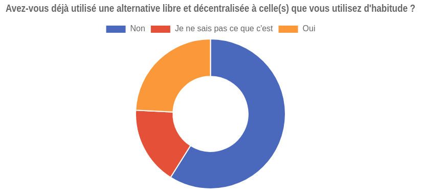

# Modèle économique

### Le modèle "payer pour créer"

>vimeo

...

### La cryptomonnaie, une alternative viable ?

>dtube, popchest, viewly

...

### Le financement participatif

>utip, tipeee, ...

...

### Ressources

-   [Offres payantes de Vimeo][1]

[1]: https://vimeo.com/upgrade
