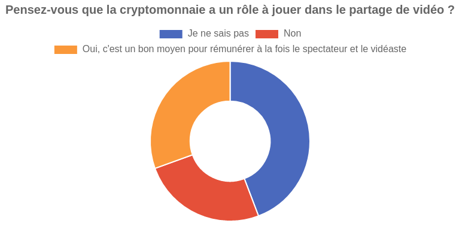

# Modèle économique

...

### Le modèle "payer pour créer"

Depuis 2017, Vimeo propose des offres payantes à ses utilisateurs, notamment pour pouvoir ajouter davantage de vidéo. L'offre payante se compose de 4 propositions allant de 6 à 70€ par mois : **Plus**, **Pro**, **Business**, **Premium**.

Les principaux avantages des offres payantes sont les suivants :

- Plus d'espace de stockage pour ajouter des vidéos
- Possibilité de créer une équipe pour collaborer
- Diffusion en direct
- Personnalisation du player vidéo
- Support des formats vidéo 4K et HDR
- Suppression de la publicité
- Fonctionnalité de création de vidéo en ligne
- Statistiques avancées
- Support client prioritaire
- Fonctionnalité de vente de vidéos
- Fonctionnalités marketing
- Meilleur contrôle du respect de la vie privée

### La cryptomonnaie, une alternative viable ?

> dtube, popchest, viewly

...

### Le financement participatif

> utip, tipeee, ...

...

* * *

### Ressources

-   [Offres payantes de Vimeo][1]

[1]: https://vimeo.com/upgrade
